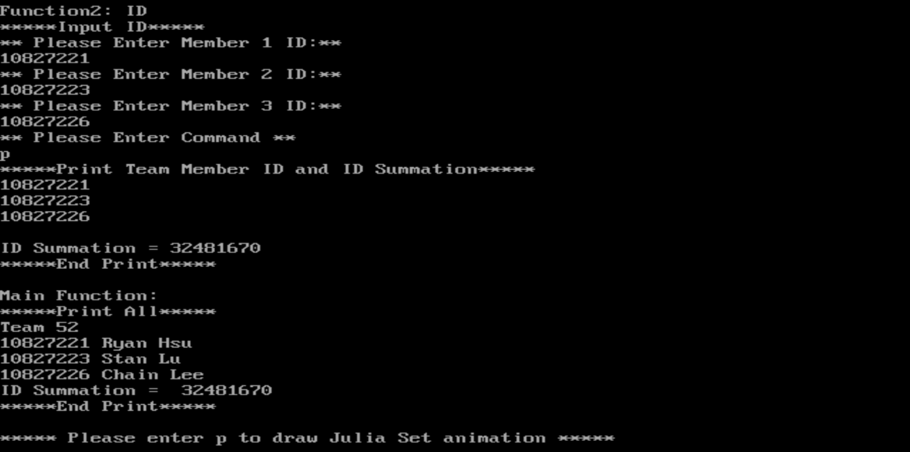
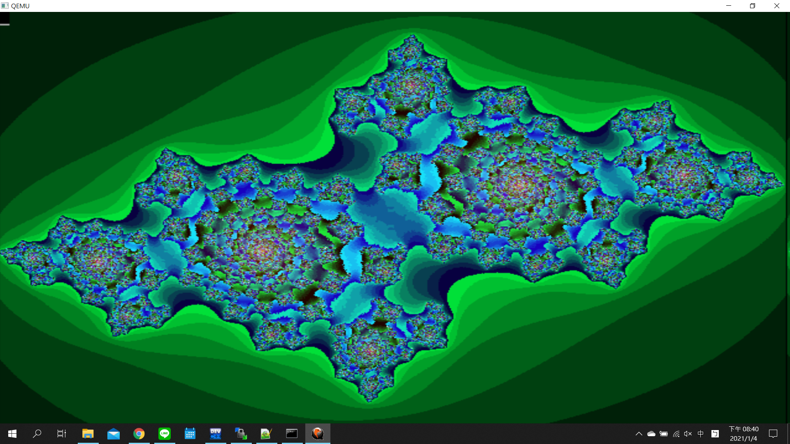

# Assembly Language and Embedded System Final Project
> 第 52 組  
> 10827221 許俊偉
> 10827223 呂紹至
> 10827226 李承謙 

## Introduction
使用 **GCC、GAS、GDB** 與 **Code::Blocks**，撰寫一個 **ARM 組合語言程式** 之project，並在模擬 ARM 處理器的環境中執行與驗證，並且實現 **Julia Set 分形圖形** 的視覺化，所有程式均需以 ARM Assembly Language 完成。該專案包含四個主要功能：  
1. **Name 函數** – 印出組別與組員姓名。  
2. **ID 函數** – 允許使用者輸入三組學號，顯示並計算學號總和。  
3. **drawJuliaSet 函數** – 計算並繪製 Julia Set 圖形，將結果顯示於畫面上。  
4. **Main 函數** – 整合所有功能並執行。

## Feature Description
### Name 函數:  
1. 首先，先規劃四個記憶體區塊，分別存放組別及組員姓名(英文)  
2. 撰寫程式，把四個記憶體區塊的內容印出來

### ID 函數:  
1. 規劃四個記憶體區塊，之後輸入學號時存放用  
2. 請使用者輸入三個學號，並將三個學號存入先前規劃的記憶體  
3. 將學號作加總，並將結果存入第四個記憶體區塊  
4. 請使用者輸入指令，若指令為 p，就分行印出完整的組員學號與學號總和，若指令不為p 就結束

### drawJuliaSet 函數:  
1. 規劃兩個記憶體區塊，分別存放之後拿來比較使用的數字(1500,4000000)  
2. r4-r10的暫存器分別拿來當作cX, cY, width, height, i, x, y使用，因為main裡呼叫 drawJuliaSet 時帶有參數，分別為cX, cY, width, height 分別存在r0-r3，因此，先把r0-r3的值存放到r4-r7  
3. 參考所給的 drawJuliaSet.c 範例程式，以 ARM 組合語言重新設計 drawJuliaSet 函數

### Main 函數:  
1. 在 Main 函數中呼叫 Name, ID 與 drawJuliaSet 函數，分別達成前三支函數的分項功能  
2. 應用 NAME 與 ID 函數所記錄的資料，輸出完整的組別、組員學號、組員名字、學號加總的計算結果以及指定的字串  

## Execution Flow
1. 執行 Name 函數的原始功能:印出組別及組員名字  
	  
2. 開始執行 ID 函數:分別輸入三位學生的學號(ID1, ID2, ID3)，如下圖  
	
3. 請使用者輸入指令(command)，如下圖  
	
4. 若 command 為 p，則:
	- 印出組員學號及學號加總結果
	- 整合組別、組員學號、組員名字、學號加總並印出
	- 請使用者輸入指令(command)，如下圖  
	  
5. 若 command 為 p，則開始執行 drawJuliaSet 函數，以下為 **繪製 Julia Set 畫面** :  
	  
	  
	  
	  
	  
 
## Specified Description
### drawJuliaSset 函數
1. 儲存 frame 位置的暫存器為sp，其起始記憶體位址為0xbef69490  
	  
2. 儲存 frame 位置的暫存器為sp，其結束記憶體位址為0xbefff48f  
	  
	  
3. frame 陣列的記憶體區塊部份內容:  
	圖中記憶體內容存的數字，ex: 0707(16) = 1798(10)，此數值為二維陣列裡其中一個值，在結束此函數後，會將此數值轉換為某個 16-bit 的 pixel 顏色  
	  

### Main 函數
1. 儲存Name 函數所在位置的暫存器為pc，其內容為0x8bdc  
	  
2. 儲存Name 函數返回位置的暫存器為lr，其內容為0x8970  
	  
3. 儲存ID 函數所在位置的暫存器為pc，其內容為0x87bc  
	  
4. 儲存ID 函數返回位置的暫存器為lr，其內容為0x897c  
	  
5. 儲存drawJuliaSet 函數所在位置的暫存器為pc，其內容為0x862c  
	  
6. 儲存drawJuliaSet 函數返回位置的暫存器為lr，其內容為0x8a90  
	  

## Discussion
  各組員分工方式與負責項目:
> 程式設計:許俊偉、呂紹至、李承謙  
    程式撰寫:許俊偉、呂紹至  
    報告製作:許俊偉、李承謙

