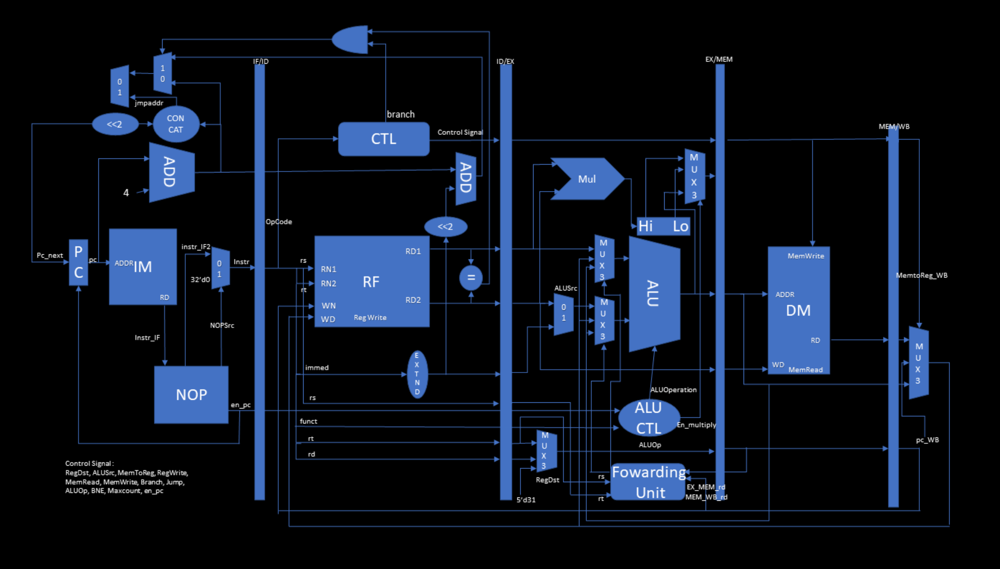
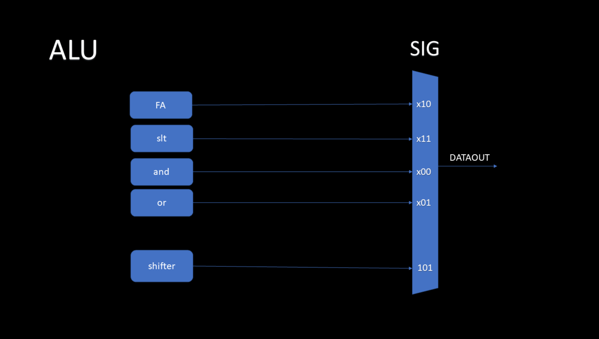
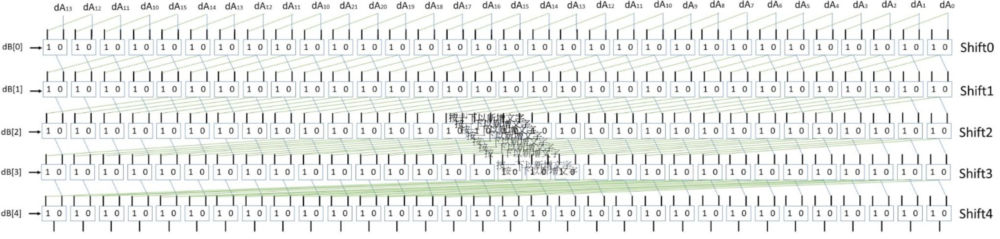
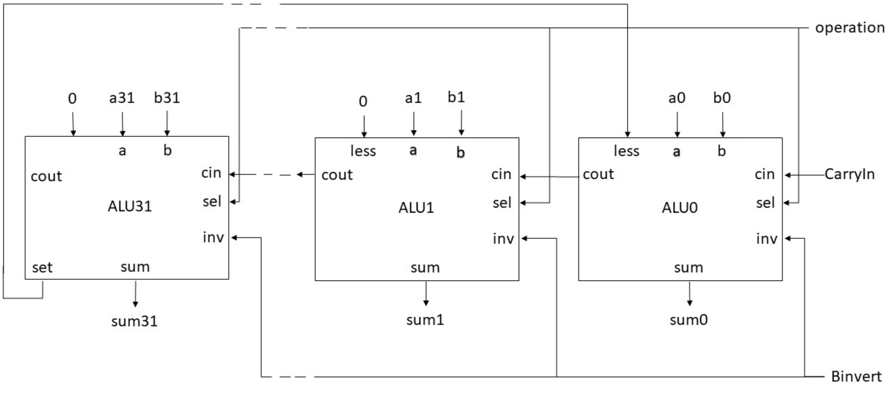
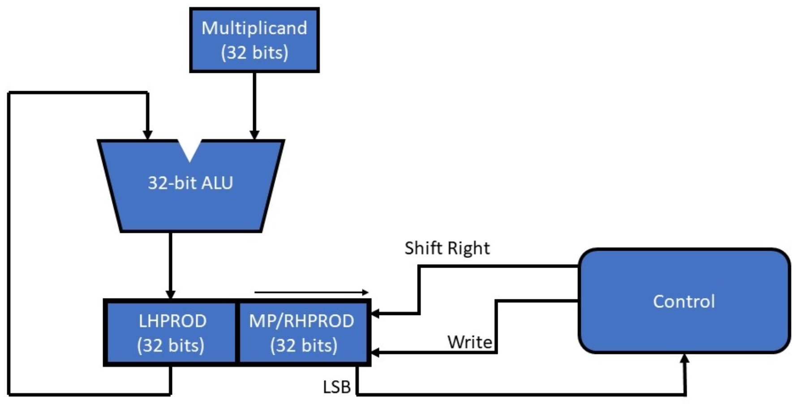

# Computer Organization Final Project
> 第25組  
> 10827214 黃瀚霆 10827221 許俊偉 10827223 呂紹至 10827226 李承謙

## Introduction
使用 Verilog HDL 與 Icarus Verilog 模擬器 ，以 Midterm Project 所設計之 ALU Design 為基
礎，參考課本 Chapter 4 與課程講義之 Pipelined Datapath，設計一個 Pipelined MIPS-Lite
CPU，並且需完成下列 16 道 MIPS 指令
1. Integer Arithmetic: **add, sub, and, or, sll, slt, addiu**
2. Integer Memory Access: **lw, sw**
3. Integer Branch: **beq, j, jal**
4. Integer Multiply/Divide: **multu**
5. Other Instructions: **mfhi, mflo, nop**

## Datapath and Architecture
### Pipelined MIPS-Lite CPU

### ALU

### Multiplier

### Shifter

## Feature Description
1.  IF‌:‌ 指‌令‌摘‌取‌（‌Instruction‌ Fetch‌）‌簡‌稱‌IF‌，IF‌階‌段‌主‌要‌負‌責‌指‌令‌抓‌取‌的‌動‌作。
2.  ID: 指令解碼（Instruction Decode）簡稱ID，ID階段主要是負責指令的解為動作和暫存器陣列的讀取動作。
3.  EX: 指令執行（Instruction Execute）簡稱EX。EX階段主要負責一般算術邏輯運算和記憶體存取位址的計算。
4.  MEM: 記憶體存取(Data Memory) 簡稱MEM。MEM階段主要在處理Data Memory(DM)的存取動作。
5.  WB: 資料寫回(Write Back）簡稱WB。WB 階段主要是負責將結果寫回Register Bank中。
6.  ALU: 創立31個unitALU並將他們接起來表示一個32bit的ALU，裡面處理了ALU/shifter等功能。

  
7.  
