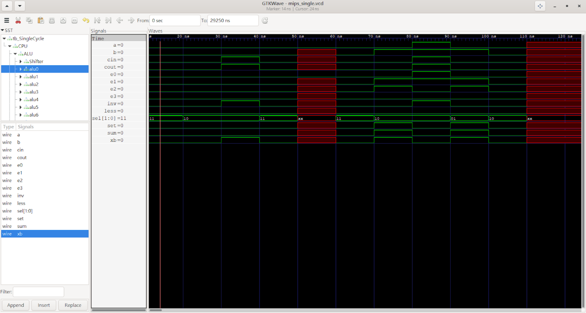
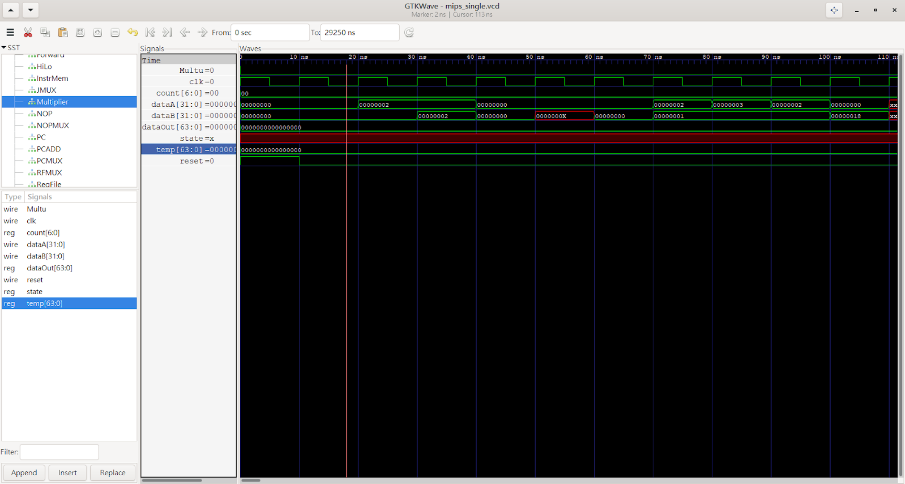
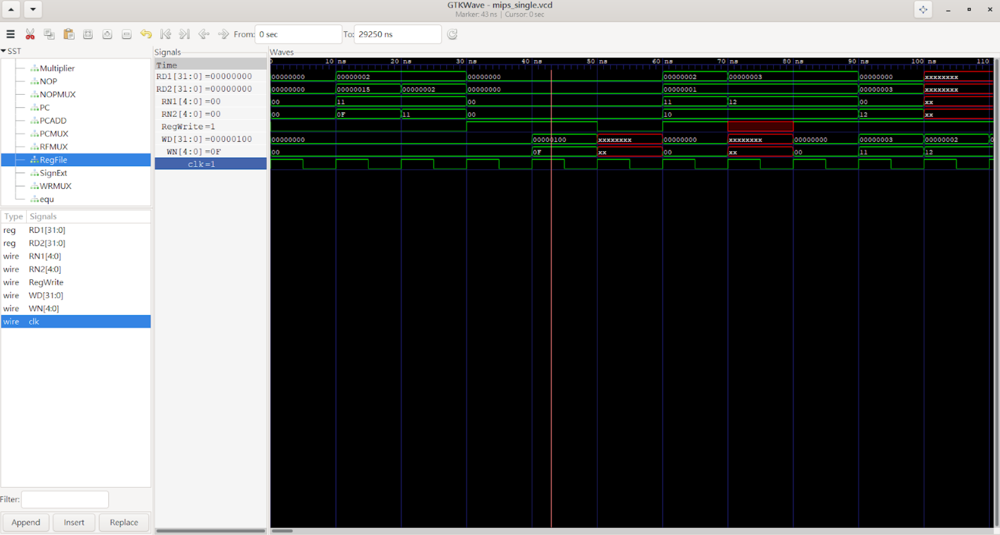
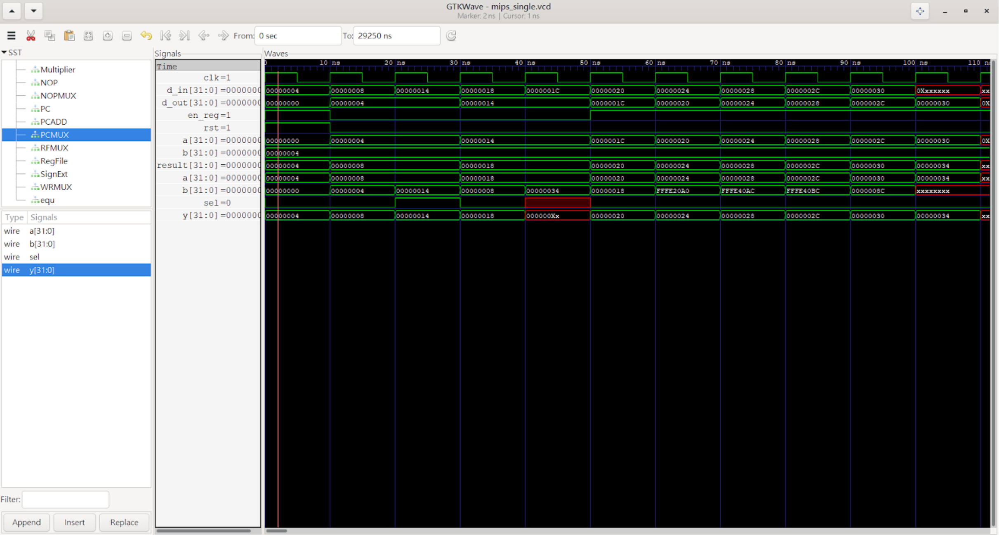
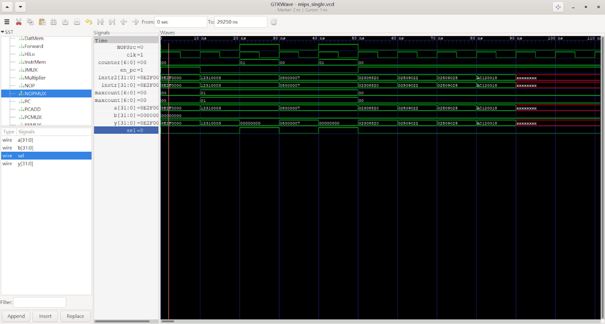
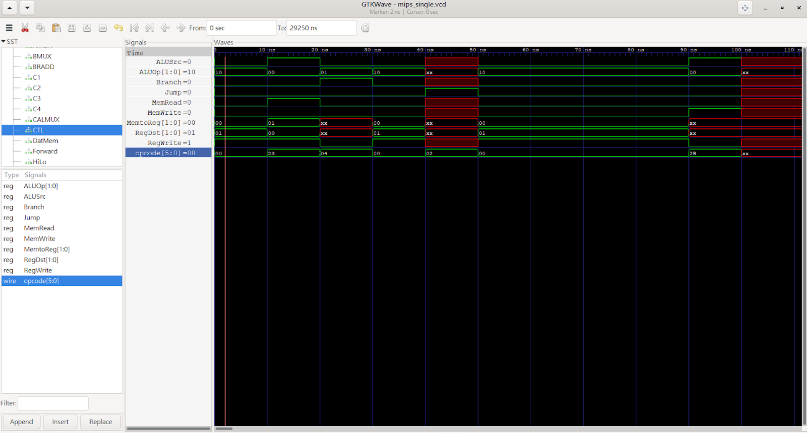
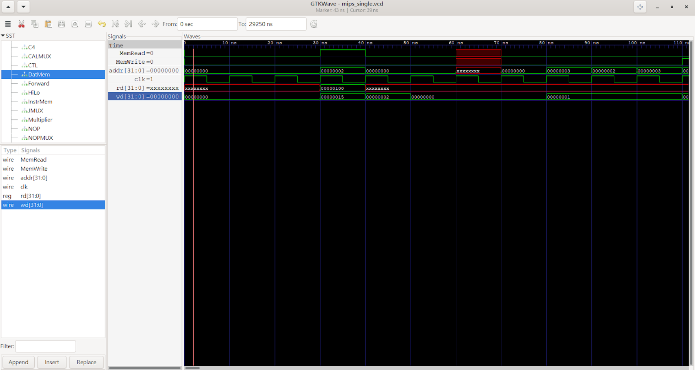
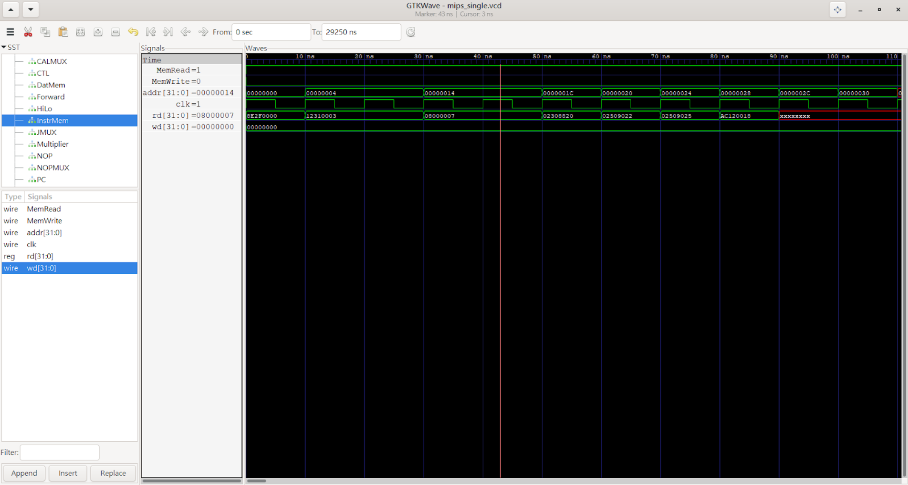
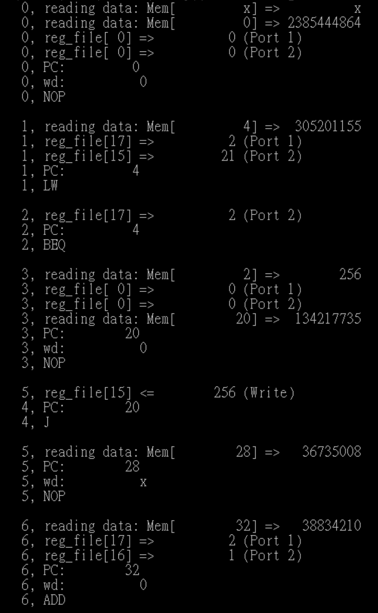
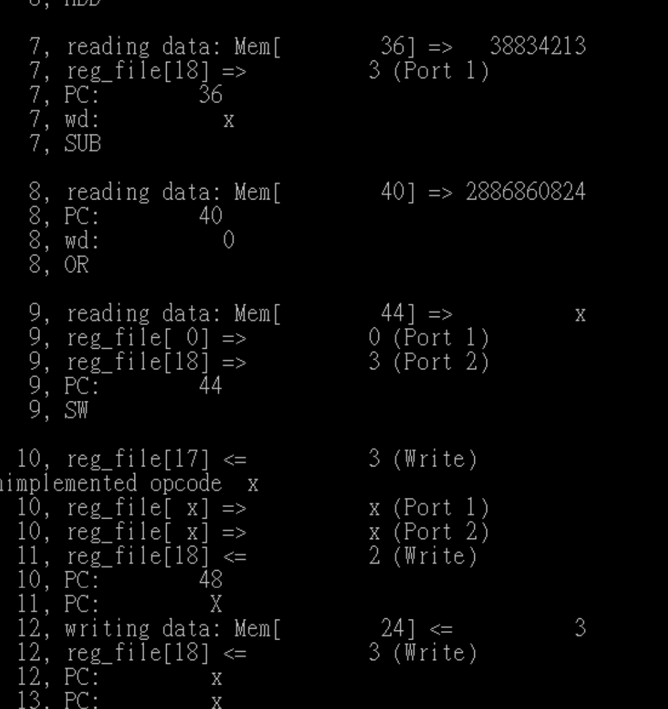

# Computer Organization Final Project
> 第25組  
> 10827214 黃瀚霆 10827221 許俊偉 10827223 呂紹至 10827226 李承謙

## Introduction
使用 Verilog HDL 與 Icarus Verilog 模擬器 ，以 Midterm Project 所設計之 ALU Design 為基
礎，參考課本 Chapter 4 與課程講義之 Pipelined Datapath，設計一個 Pipelined MIPS-Lite
CPU，並且需完成下列 16 道 MIPS 指令
1. Integer Arithmetic: **add, sub, and, or, sll, slt, addiu**
2. Integer Memory Access: **lw, sw**
3. Integer Branch: **beq, j, jal**
4. Integer Multiply/Divide: **multu**
5. Other Instructions: **mfhi, mflo, nop**

## Feature Description
1.  IF‌:‌ 指‌令‌摘‌取‌（‌Instruction‌ Fetch‌）‌簡‌稱‌IF‌，IF‌階‌段‌主‌要‌負‌責‌指‌令‌抓‌取‌的‌動‌作。  
2.  ID: 指令解碼（Instruction Decode）簡稱ID，ID階段主要是負責指令的解為動作和暫存器陣列的讀取動作。  
3.  EX: 指令執行（Instruction Execute）簡稱EX。EX階段主要負責一般算術邏輯運算和記憶體存取位址的計算。
4.  MEM: 記憶體存取(Data Memory) 簡稱MEM。MEM階段主要在處理Data Memory(DM)的存取動作。
5.  WB: 資料寫回(Write Back）簡稱WB。WB 階段主要是負責將結果寫回Register Bank中。
6.  ALU: 創立31個unitALU並將他們接起來表示一個32bit的ALU，裡面處理了ALU/shifter等功能。
7.  alu_ctl: 來決定要做哪種運算(add, sub, and, or, slt, Multu...)並將對應的訊號傳入對應的電路中。  
8. unitALU: 為1-bit 的 ALU，功能為執行 1-bit ALU 的運算，包含 AND, OR, ADD, SUB, SLT 等功能，結果為以 Ripple-Carry 的進位方式，在 ALU 裡連接 32 個 1-bit ALU Bit Slice，成為 32-bit ALU。
9. FA: 為 unitALU 內部所使用的全加器，可執行 ADD, SUB 等運算。
10. Shifter: 設計 32-bits Barrel Shifter，以完成邏輯左移運算。以課程講義[1]P.28 所 描述之設計方式，以 Data Flow Modeling(Continuous Assignments)完成。本模組為組合邏輯(Combinational Logic)。
11. Multiplier: 為 32-bits 無號數乘法 Sequential Multiplier，採用 Third Version Sequential Multiplier 來設計，參考課程講義[2] P.02-P.14。本模組為循序邏輯(Sequential Logic)，以 Clock 訊號同步。
12. muxsll: 為 Shifter 內部所使用的2 to 1 多工器，功能為視訊號而選擇輸出原本的值或移位(1, 2, 4, 8 or 16)後的結果。
13. HiLo: 為乘法器計算完後，儲存計算結果之 64-bit 暫存器，其功能為將 64-bit 的乘法器計算結果分割成兩個 32-bit 暫存器(HiOut, LoOut)。本模組為循序邏輯(Sequential Logic)，以 Clock 訊號同步。
14. NOP: 判斷指令是否為Beq、J、Multu 等需要 stall 的指令，若需要stall，則在此module 做設定。

## Datapath and Architecture
### Pipelined MIPS-Lite CPU

### unitALU

### Shifter

### ALU

  

### Mutiplier

  

## Verification Result
### Waveform 輸出圖形
#### ALU (以ALU0為代表)

  

#### Multiplier

  

#### RF

  

#### PC

  

#### NOP

  

#### CTL

  

#### DM

  

#### IM

  

#### 輸出結果

  

  

## Discussion
各組員分工方式與負責項目:
> 程式設計:黃瀚霆、許俊偉、呂紹至、李承謙  
程式撰寫:黃瀚霆、許俊偉  
報告製作:黃瀚霆、許俊偉、呂紹至、李承謙
