# Computer Organization Midterm Project
> 第25組  
> 10827214 黃瀚霆 10827221 許俊偉 10827223 呂紹至 10827226 李承謙

## Introduction
使用 Verilog HDL 與 Icarus Verilog 模擬器，以計算機組織課程講義：  
[1] Chapter 3:Arithmetic for Computers Part 1: ALU (Add/Subtraction)  
[2] Chapter 3:Arithmetic for Computers Part 2: Multiplication and Division  
[3] Chapter 3:Supplement: Verilog Concepts  
為基礎，設計 ALU 與乘法器，以供 Final Project 之用。

## Feature Description
1. ALU: 包含 32-bits AND, OR, ADD, SUB, SLT 等功能，並以課程講義[1]P.12-P.28 所述之設計方式，使用 Gate-Level Modeling 與 Data Flow Modeling (Continuous Assignments)，從 Full Adder 做起，以 Ripple-Carry 的進位方式， 連接 32 個 1-bit ALU Bit Slice，成為 32-bit ALU。本模組為組合邏輯(Combinational Logic)。  
2. unitALU: 為1-bit 的 ALU，功能為執行 1-bit ALU 的運算，包含 AND, OR, ADD, SUB, SLT 等功能，結果為以 Ripple-Carry 的進位方式，在 ALU 裡連接 32 個 1-bit ALU Bit Slice，成為 32-bit ALU。
3. FA: 為 unitALU 內部所使用的全加器，可執行 ADD, SUB 等運算。
4. muxALU: 為 unitALU 內部所使用的4 to 1多工器，功能為視訊號而選擇讓AND, OR, ADD/SUB, SLT 的結果作為 unitALU 的輸出。
5. Multiplier: 為 32-bits 無號數乘法 Sequential Multiplier，採用 Third Version Sequential Multiplier 來設計，參考課程講義[2] P.02-P.14。本模組為循序邏輯(Sequential Logic)，以 Clock 訊號同步。
6. Shifter: 設計 32-bits Barrel Shifter，以完成邏輯左移運算。以課程講義[1]P.28 所 描述之設計方式，以 Data Flow Modeling(Continuous Assignments)完成。本模組為組合邏輯(Combinational Logic)。
7. mux2: 為 Shifter 內部所使用的2 to 1多工器，功能為視訊號而選擇輸出原本的值或移位(1,2,4,8or16)後的結果。
8. HiLo: 為乘法器計算完後，儲存計算結果之 64-bit 暫存器，其功能為將 64-bit 的乘法器計算結果分割成兩個 32-bit 暫存器(HiOut, LoOut)。本模組為循序邏輯(Sequential Logic)，以 Clock 訊號同步。
9. MUX:多工器，以 Data Flow Modeling 設計，功能為視訊號而選擇讓 AND, OR, ADD, SUB, SLT, Hi暫存器, Lo暫存器, Shifter 的結果作為 TotalALU 的輸出。 本模組為組合邏輯(Combinational Logic)。
10. ALUControl: 根據輸入的 6-bit 控制訊號，決定該完成哪一種運算。控制訊號與功能 對應如下：
    
    **Signal : 6-bit Value (Decimal)**
    ------------------------------------
    | Instruction | Value (Decimal) |
    |-------------|----------------|
    | **AND**     | 36             |
    | **OR**      | 37             |
    | **ADD**     | 32             |
    | **SUB**     | 34             |
    | **SLT**     | 42             |
    | **SLL**     | 00             |
    | **MULTU**   | 25             |
    ------------------------------------
    本模組為循序邏輯(Sequential Logic)，因此須以 Clock 訊號同步。
11. TotalALU: 為定義各種訊號、接線，建立各種模組之場所。
12. tb_ALU: 為所設計之模組之測試平台，須以讀檔的方式，讀入測試資料。以驗證所設計之模組，功能正確性。

## Methodology
### ALU
> input: reset, [31:0] dataA, [31:0] dataB, [5:0] Signal  
  output: [31:0] dataOut  
  wire: [31:0] temp, [31:0] c, [1:0] op, cin, inv, less, set
1. 定義各種訊號:  
   若 Signal 為 ADD，將 inv 和 cin 設為 0，否則為 1；將 less 設為 0； op 作為 unitALU 的輸入，其值視 Signal 決定 (AND:00, OR:01, ADDD/SUB:10, SLT:11)；temp 用來儲存每個 unitALU 的 sum； c 為用來儲存每個 unitALU 的 cout 及作為下一個 unitALU 的 cin； set 只有在 alu31 時作為輸出，alu0 時作為 less 的輸入，其他時候無作用；less 恆為 0，作為 alu1 ~ alu31 的輸入；inv 作為 unitALU 的輸入。
2. 呼叫 32 次 unitALU ( alu0, alu1,.....alu31 )，達成 Ripple-Carry 的進位方式。
3. 若 reset 為 1，則將 dataOut 設為 0，否則將其設為 temp。

### unitALU
> input: a, b, cin, less, inv, [1:0] sel          
  output: cout, sum, set  
  wire: e0, e1, e2, e3, xb;
1. 執行各種運算:  
   進行輸入端 b, inv 的互斥或(xor)運算，將結果存在 xb
   進行輸入端 a, b 的 and 運算，將結果存在 e0
   進行輸入端 a, b 的 or 運算，將結果存在 e1
2. 呼叫 FA (fa)，進行 a, xb 的 Full-Adder(FA) 運算，將結果存在 e2，並設定 cout 的值。
3. 將 set 設為 e2, e3 設為 less。
4. 呼叫 muxALU (muxalu)，根據訊號(sel)，決定將 e0, e1, e2, e3 何者作為輸出(sum)。

### FA
> input: a, b, c  
  output: cout, sum  
  wire:   e1, e2, e3
1. 執行各種運算:  
      進行輸入端 a, b 的互斥或(xor)運算，將結果存在 e1  
      進行輸入端 a, b 的 and 運算，將結果存在 e2  
      進行輸入端 e1, c 的 and 運算，將結果存在 e3  
      進行輸入端 e2, e3 的 or 運算，結果用來設定 cout  
      進行輸入端 e1, c 的互斥或(xor)運算，結果用來設定 sum

### muxALU
> input: e0, e1, e2, e3, [1:0] op  
    output: out
1. 以 op 的值決定輸出(out):   
      op 為 2'b00: 輸出為 e0,  op 為 2'b01: 輸出為 e1,  
      op 為 2'b10: 輸出為 e2,  op 為 2'b11: 輸出為 e3。

### Multiplier
> input: clk, reset, [31:0] dataA, [31:0] dataB, [5:0] Signal  
    output: [63:0] dataOut  
    reg: [63:0] temp
1. 本設計在 always block 內進行，其觸發條件為當 reset 值有更動及 clk 訊號由 0 轉 1 的時候，在 always block 外，會將 temp 的值傳給輸出(dataOut)。
2. 將 temp 右半 32-bit 改為 dataB(乘數)。
3. 若 temp 的第 0 位元(temp[0]) 為 1，將 temp 左半 32-bit 加上 dataA，若 temp[0] 為 0 則不做任何操作。
4. 將 temp 右移 1 bit。
5. 重複 3.~4.，直到執行 32 次後結束。

### Shifter
> input: reset, [31:0] dataA, [31:0] dataB, [5:0] Signal  
    output: [31:0] dataOut  
    wire: [31:0] s1, s2, s3, s4
1. 本設計將會呼叫 5 次 mux2，分別為 shift0, shift1,...shift4
2. 每個 mux2 將會選擇輸出原本的值或輸出移位後的值(shift0 ~ shift4的移位量分別為1, 2, 4, 8, 16)；s1 ~ s4 則為五個 mux2 的連接點(s1為 shift0 的輸出、shift1 的輸入.....以此類推)
3. 最後 shift4 的輸出為 dataOut。

### mux2
> input: [31:0] a0, [31:0] a1, select  
    output: [31:0] x
1. 根據 select 訊號決定輸出(x) 為 a0(原本的值) 或 a1(移位後結果)

### HiLo
> input: clk, reset, [63:0] MultuAns  
    output: [31:0] HiOut, [31:0] LoOut  
    reg: [63:0] HiLo
1. 本設計為將 64-bit 的乘法器計算結果分割成兩個 32-bit 暫存器(HiOut, LoOut)。
2. 若 reset 訊號為 1，則將 HiLo 設為 0，否則將 MultuAns 的值傳給 HiLo，最後將 HiLo 的最高 32-bit 值傳給 HiOut，最低 32-bit 值傳給 LoOut 並結束。

### MUX
> input: [31:0] ALUOut, [31:0] HiOut, [31:0] LoOut, [31:0] Shifter, [5:0] Signal  
    output: [31:0] dataOut  
    wire: [31:0] temp 
1. 根據 Signal 訊號決定將 ALUOut, HiOut, LoOut, Shifter 何者的值傳給temp，最後將 temp 的值傳給 dataOut 作為輸出。

### ALUControl
> input: clk, [5:0] Signal  
    output: [5:0] SignaltoALU, [5:0] SignaltoSHT, [5:0] SignaltoMULTU, [5:0] SignaltoMUX  
    reg: [6:0] counter 
1. 本設計為根據輸入的 6-bit 控制訊號，決定該完成哪一種運算，如果訊號改變成乘法，就把 counter 歸 0，並開始數32個 clk 然後開啟 HiLo 暫存器給乘法器放值進去，最後將 Signal 的值傳給所有 output。

## Datapath and Architecture
### TotalALU   

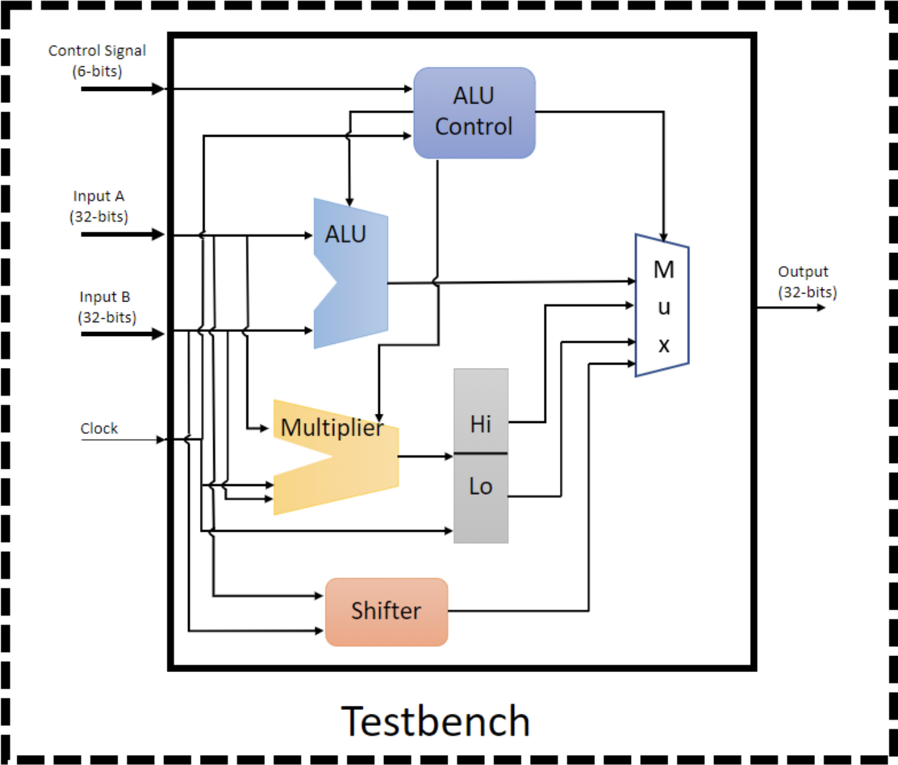
  
    
### ALU  

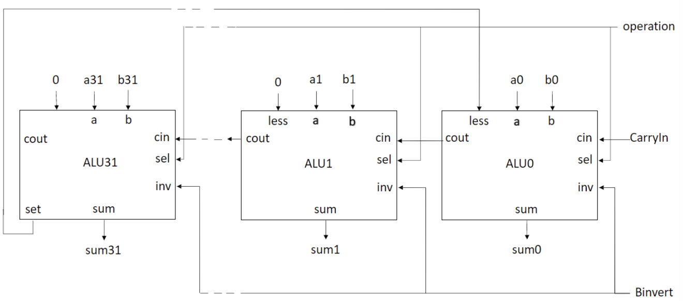

### Multiplier  

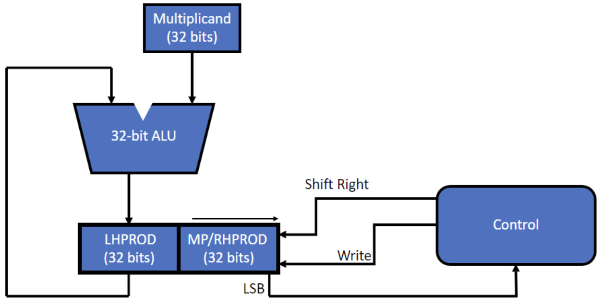

### Shifter  

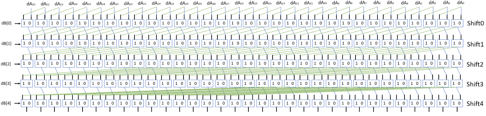

## Verification Result  
### Input 檔內容

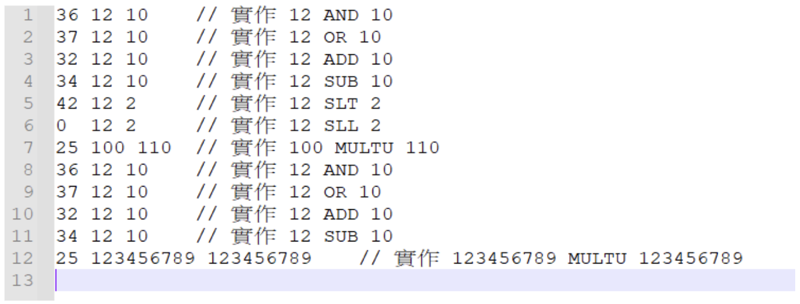

### Icarus Verilog 驗證結果

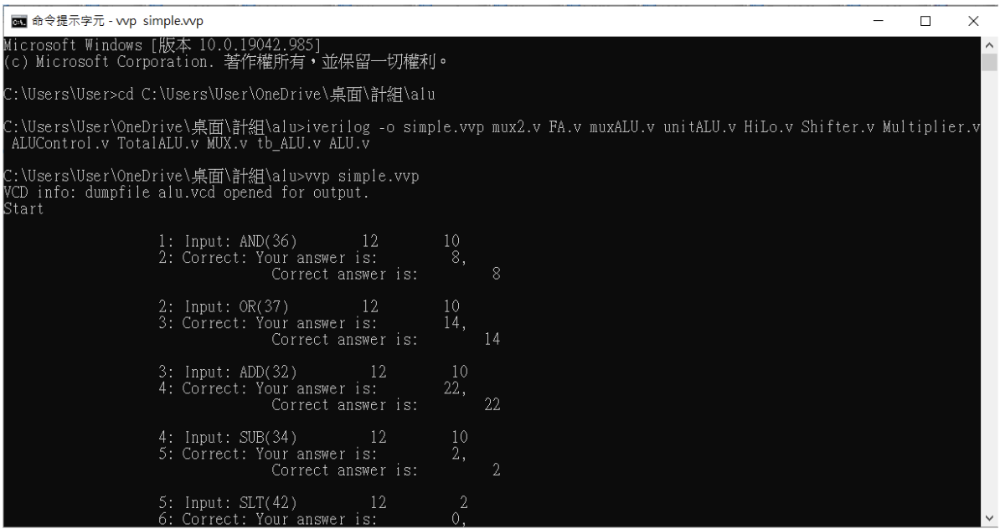

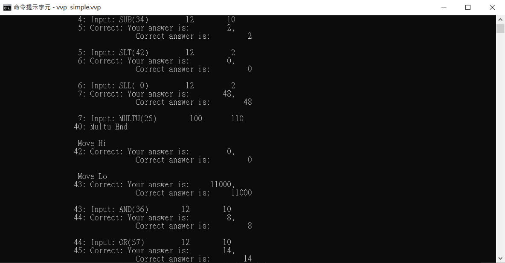

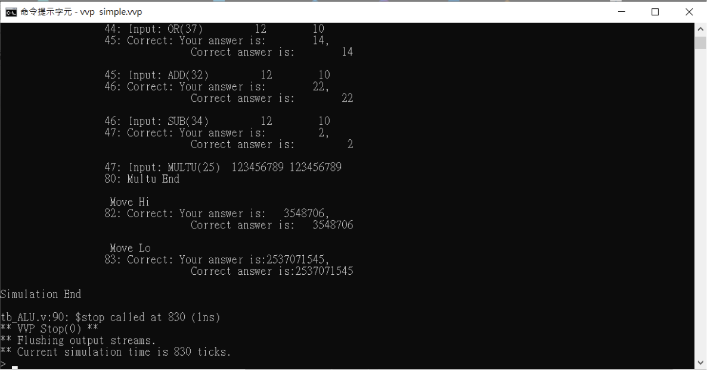

### Waveform 輸出圖形
#### ALU (以alu0為代表)

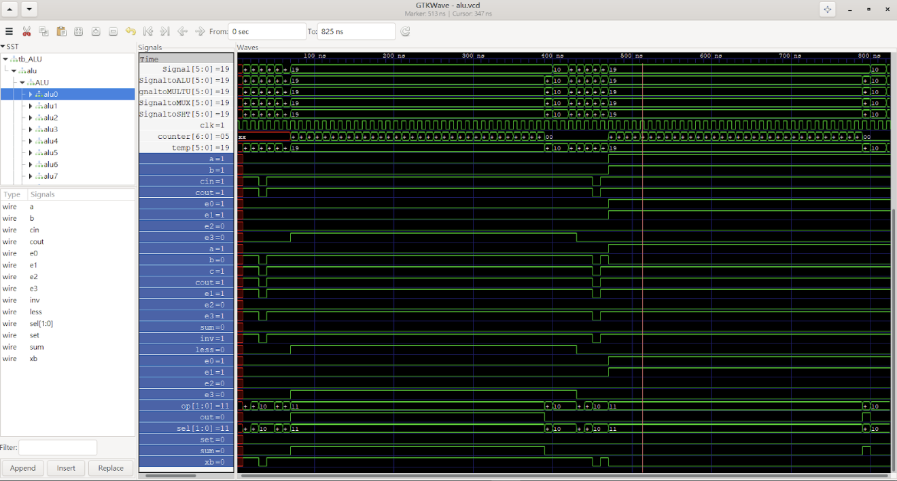

#### Multiplier

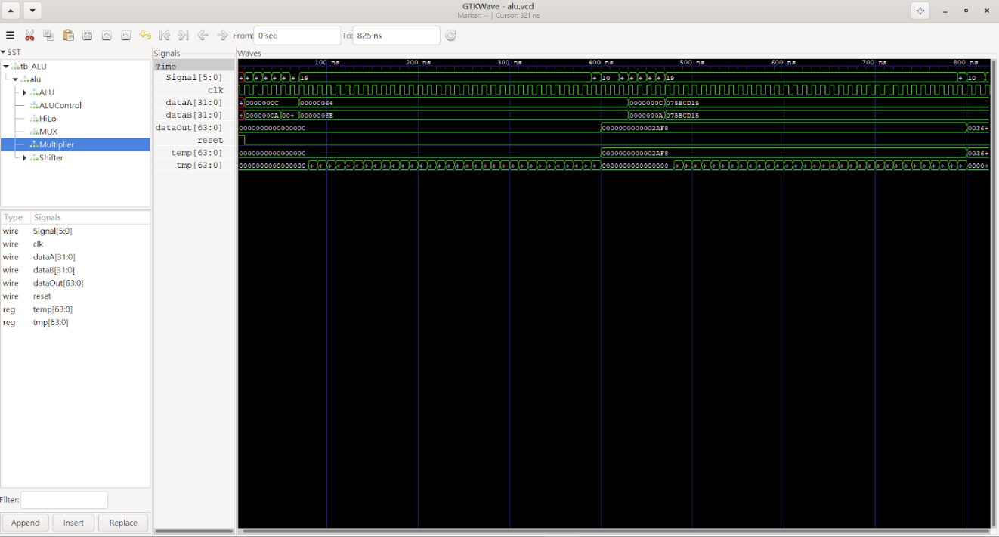

#### Shifter (以shift0為代表)

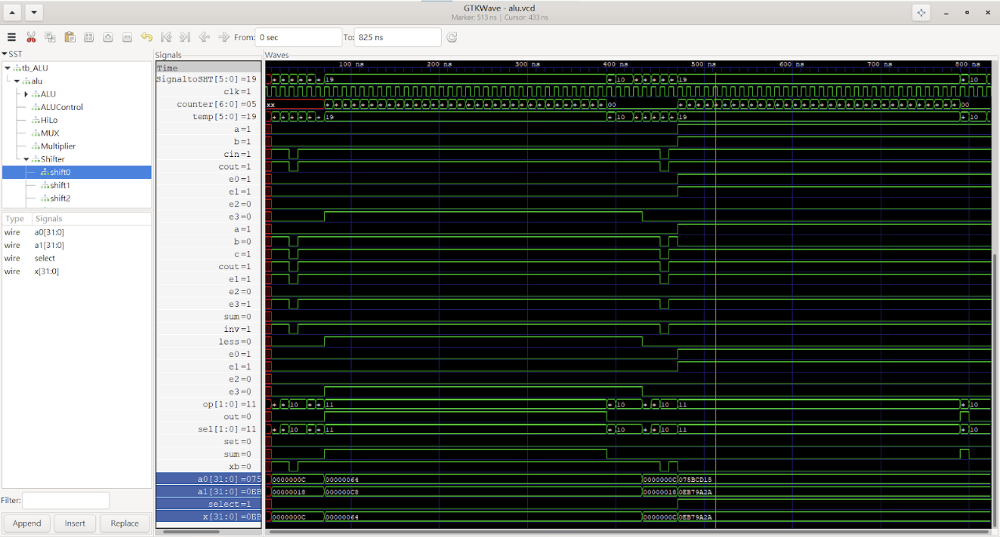

#### HiLo

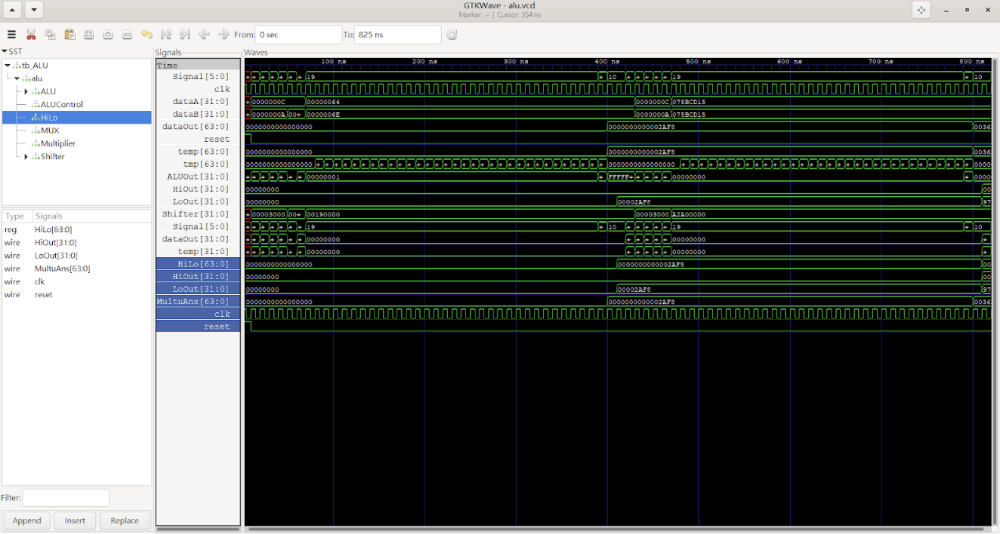

#### MUX

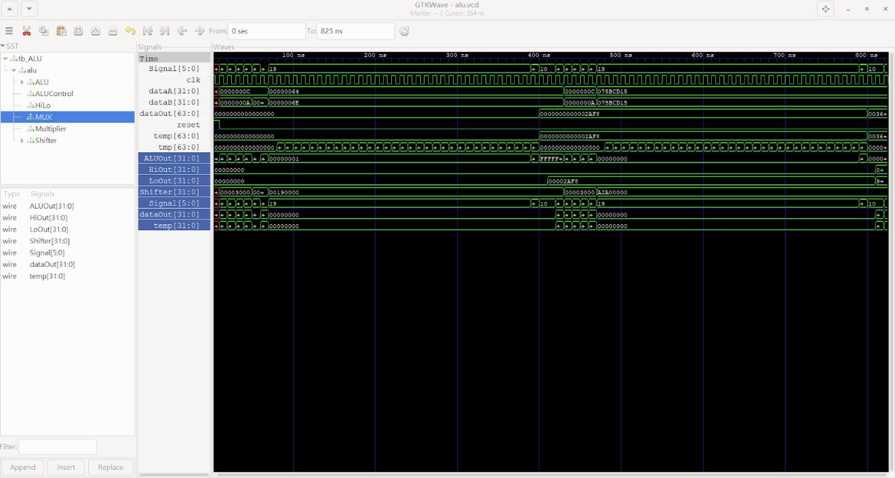

#### ALUControl

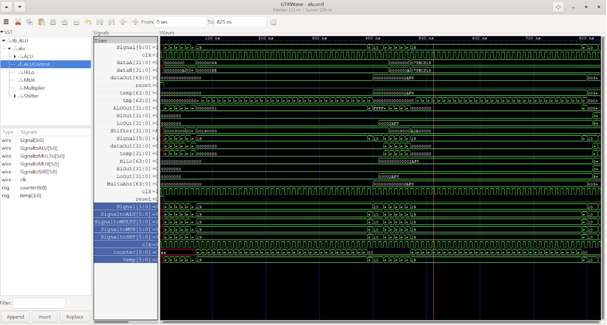

## Discussion
各組員分工方式與負責項目:
> 程式設計:黃瀚霆、許俊偉、呂紹至、李承謙  
    程式撰寫:黃瀚霆、許俊偉  
    報告製作:黃瀚霆、許俊偉、呂紹至、李承謙
